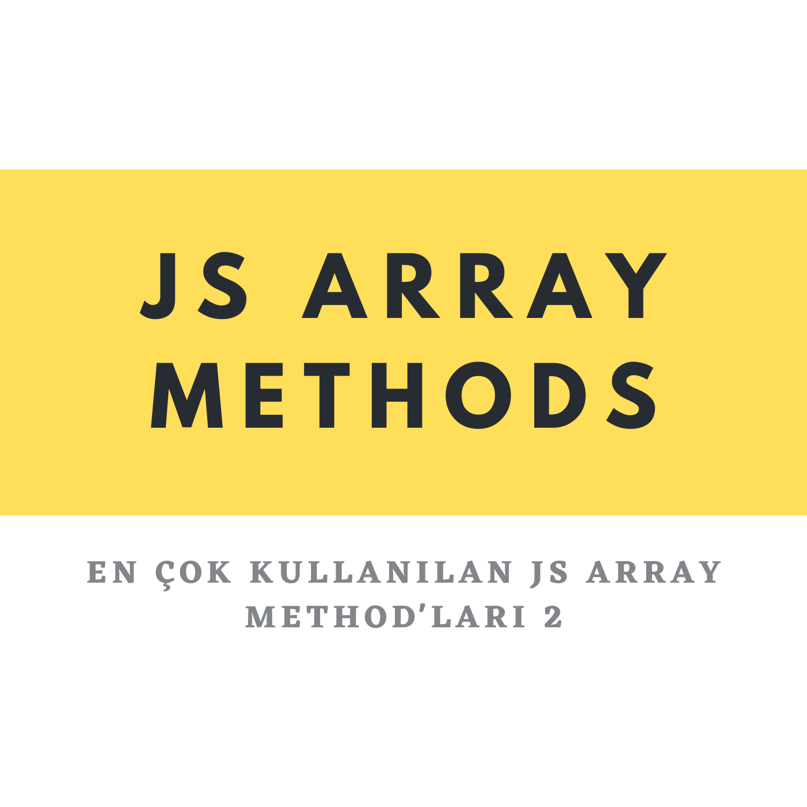

<center>
</center>
<br>

<center>

# JavaScript En Çok Kullanılan Array Method'ları - 2

</center>

## forEach method'u

`forEach` method'u, içinde yapılan işlemi elemanlara sırası ile uygular.

```javascript
meyveler = ["🍎", "🍌", "🍉"];

meyveler.forEach((meyve) => {
    console.log(meyve);
});
// 🍎
// 🍌
// 🍉
```

`Dikkat` : Orijinal Array'de bir değişim olmaz.

```javascript
console.log(meyveler); // [ '🍎', '🍌', '🍉' ]
```

`forEach` method'unun kullanımı bununla sınırlı değil. Daha fazla bilgi için [buraya](https://www.w3schools.com/jsref/jsref_foreach.asp) göz atabilirsiniz.

## map method'u

`map` Method'u içerisinde döndürdüğümüz return değerleri ile yeni bir array oluşturur.

```javascript
let sayilar = [1, 2, 3, 4, 5];

const karesiniAl = sayilar.map((sayi) => {
    return sayi * sayi;
});

console.log(karesiniAl); // [ 1, 4, 9, 16, 25 ]
```

## reduce Method'u

`reduce` method'u herhangi bir Array'de her bir elemanın üzerinde işlem yapıp işlemlerin sonucunda tek bir değer döndürür.

`.reduce( baslangic , array )`

İki parametre alır birinci parametre başlangıç değerimizi ifade eder, ikinci parametre ise sıradaki elemanı ifade eder.

```javascript
let sayilar = [1, 2, 3, 4, 5];

const topla = sayilar.reduce((topla = 0, sayi) => {
    return (topla = topla + sayi);
});

console.log(topla); // 15

const carp = sayilar.reduce((carpim = 1, sayi) => {
    return (carpim = carpim * sayi);
});

console.log(carp); // 120
```

## includes Method'u

`includes` yazılan değerin Array'deki elemanları içerip içermediğini kontrol eder. Elemanlardan biri eşleşirse `true`, eşleşmezse `false` değeri döndürür.

```javascript
let isimler = ["Recai", "Koray", "İzlimek"];

const icerirMi = isimler.includes("Koray");

console.log(icerirMi); // true
```

`Dikkat` : Büyük küçük harf duyarlıdır.

```javascript
duyarli = isimler.includes("koray");

console.log(duyarli); // false
```

## indexOf Method'u

`indexOf` method'u Array'deki elemanların yerini bulmak için kullanılır. Burada Array'lerin 0. `index`'ten başladığını unutmamalıyız.

```javascript
const rakamlar = [0, 1, 2, 3, 4, 5, 6];

let indexBul = rakamlar.indexOf(2);

console.log(indexBul); // 2
```

## find Method'u

`find` method'u Array'deki girilen koşulu ilk sağlayan elemanı döndürür.

```javascript
let array = [30, 50, 23, 21, 105];

const ilkEleman = array.find((sayi) => {
    return sayi > 32;
});

console.log(ilkEleman); // 50
```

## filter Method'u

`filter` method'u istediğiniz koşulu sağlayan elemanları yeni array oluşturarak döner.

```javascript
const calisanlar = [
    { isim: "Recai", alan: "backend" },
    { isim: "Koray", alan: "frontend" },
    { isim: "İzlimek", alan: "backend" },
];

const frontendCalisan = calisanlar.filter((calisan) => {
    return calisan.alan === "frontend";
});

console.log(frontendCalisan); // [ { isim: 'Koray', alan: 'frontend' } ]

const backendCalisan = calisanlar.filter((calisan) => {
    return calisan.alan === "backend";
});

console.log(backendCalisan);
// [
//     { isim: 'Recai', alan: 'backend' },
//     { isim: 'İzlimek', alan: 'backend' }
// ]
```


## Kaynakça

[Mozilla Array Reference](https://developer.mozilla.org/en-US/docs/Web/JavaScript/Reference/Global_Objects/Array?retiredLocale=tr)
