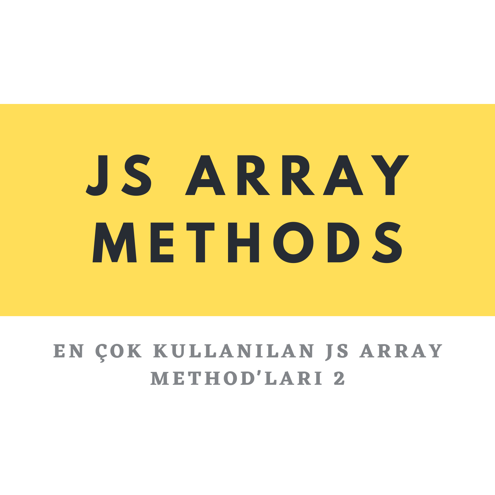

<center>
</center>
<br>

<center>

# JavaScript En Çok Kullanılan Array Metotları - 3

</center>

## concat Medtodu

concat method'u bir yada daha fazla Array'i birleştirmeyi sağlar. Concat Method'u bir immutable method'dur. Bu ozellik bize Array'lerimizin değişmediğini ifade eder.

```javascript
let meyveler = ["🍎", "🍌", "🍉"];

let sebzeler = ["🥕", "🥦", "🥒"];

const birlestir = meyveler.concat(sebzeler);

console.log(birlestir); // [ '🍎', '🍌', '🍉', '🥕', '🥦', '🥒' ]

console.log(meyveler); // [ '🍎', '🍌', '🍉' ]
console.log(sebzeler); // [ '🥕', '🥦', '🥒' ]
```

Burada gözüktüğü gibi concat method'u ile gönderdiğimiz Array'ler değişmeyecektir.

## join Medthodu

join method'u tüm elementleri içerisine yazdigimiz String ile ayırarak tek bir String'e çevirir. Sadece `.join()` olarak kullanırsak virgül ile tek bir String'e çevrilecektir.
Bunu örnek ile daha iyi anlayabiliriz.

```javascript
console.log(meyveler); // [ '🍎', '🍌', '🍉' ]

const tekString = meyveler.join();

console.log(tekString); // 🍎,🍌,🍉
```

join() methodu parantezler icerisine yazdigimiz String ile ayırır.

```javascript
const tekEleman = meyveler.join("*");

console.log(tekEleman); // 🍎*🍌*🍉
```

## includes Methodu

includes yazılan değerin Array'deki elemanları içerip içermediğini kontrol eder. Elemanlardan biri eşleşirse true, eşlesmezse false değeri döndürür.

```javascript
let isimler = ["Recai", "Koray", "izlimek"];

const icerirMi = isimler.includes("Koray");

console.log(icerirMi); // true
```

`Dikkat` : Büyük küçük harf duyarlıdır.

```javascript
duyarli = isimler.includes("koray");

console.log(duyarli); // false
```

## indexOf Methodu

indexOf method'u Array'deki elementlerin yerini bulmak için kullanılır. Burada Aarray'lerin 0. indexten başladığını unutmamalıyız.

````javascript
const rakamlar = [0, 1, 2, 3, 4, 5, 6];

const indexBul = rakamlar.indexOf(2);

console.log(indexBul); // 2
```Dikkat`: Eğer aradığımız element Array'in içerisinde yoksa -1 döndürecektir.

```javascript
indexbul = rakamlar.indexOf(7);

console.log(indexbul); // -1
````

## reverse mothodu

reverse method'u Array'in tersini alacaktir. reverse method'u orjinal diziyi değiştirir.

```javascript
const tersiniAl = rakamlar.reverse();

console.log(tersiniAl); // [ 6, 5, 4, 3, 2, 1 ]
console.log(rakamlar); // [ 6, 5, 4, 3, 2, 1 ]
```

## sort Methodu

sort methodu Array'deki elementleri sıralamamızı sağlar. sort methodu orjinal diziyi değiştirir.

```javascript
let isimler = ["Recai", "Koray", "izlimek"];

const sirala = isimler.sort();

console.log(sirala); // [ 'Koray', 'Recai', 'izlimek' ]
console.log(isimler); // [ 'Koray', 'Recai', 'izlimek' ]

const karisiksayilar = [5, 6, 4, 2, 1, 0];

console.log(karisiksayilar.sort()); // [ 0, 1, 2, 4, 5, 6 ]
```

`Dikkat`: Eğer biz tersen sıralamak istiyorsak reverse metod'u ile beraber kullanabiliriz.

```javascript
console.log(karisiksayilar.sort().reverse()); // [ 6, 5, 4, 2, 1, 0 ]
```
